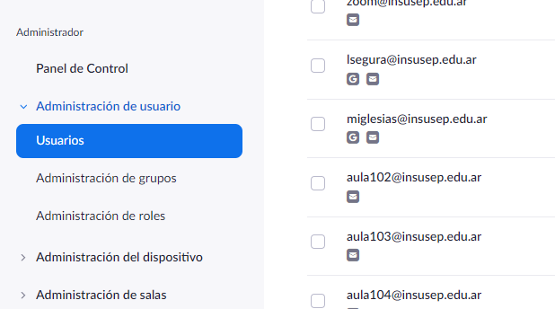
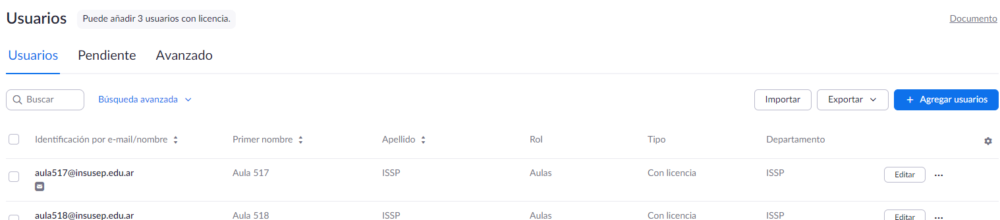
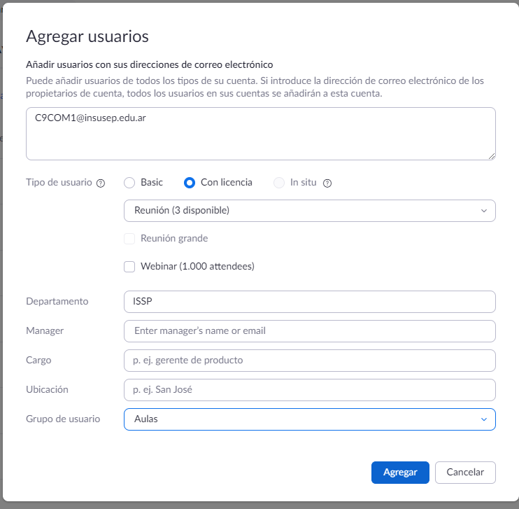
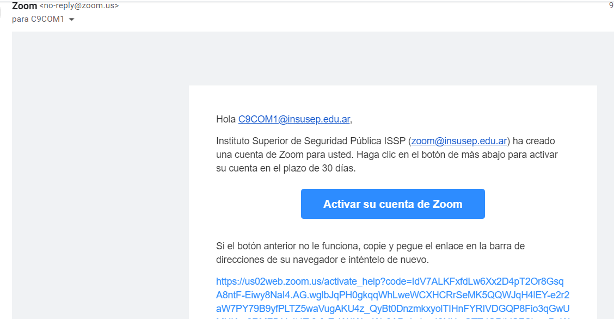
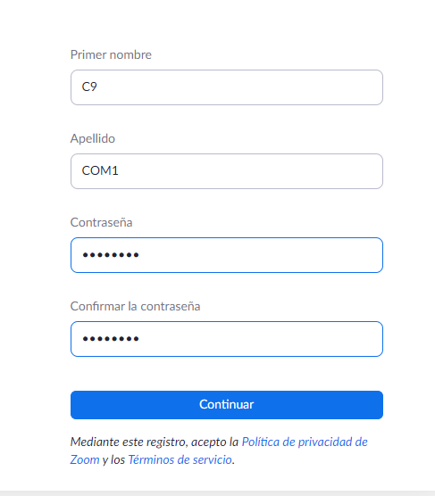
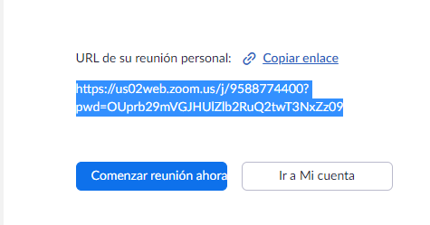
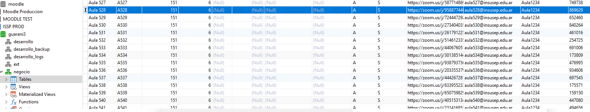
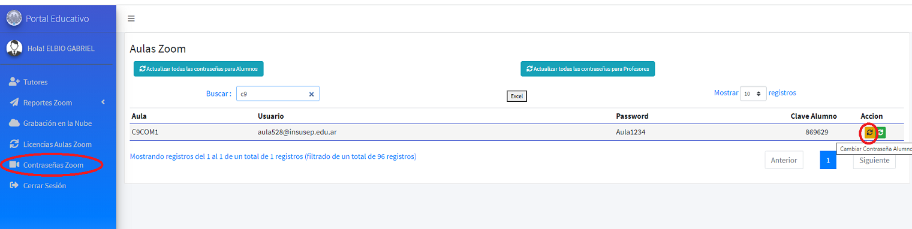

# Pasos para dar de alta nueva cuenta Zoom con Licencia

1\) Ingresar como administrador a [https://us02web.zoom.us/signin](https://us02web.zoom.us/signin)\
&#x20;   Usuario: zoom@insusep.edu.ar\
&#x20;   Contraseña: Insusep2020

2\) En el menú administrador acceder al submenú Usuarios

3\) Click en el botón “Agregar usuarios”

4\) En la ventana emergente ingresar los datos del nuevo usuario y presionar “Agregar"

5\) Iniciar sesión en la casilla del mail ingresado en paso anterior

6\) En el mail recibido desde la plataforma de zoom, hacer clic en el botón “Activar su cuenta de Zoom”

7\) En la página de Zoom a la cuál nos reenvía seleccionar la última opción “Iniciar sesión con una contraseña”

.png>)

8\) Ingresar los datos descriptivos para el nuevo usuario del zoom, y la contraseña (se está usando Aula1234 )

9\) Si se está reemplazando algún usuario/aula existente se debe cambiar los datos en la base del SIU para que los cambios se reflejen en el portal, en el ejemplo reemplazamos [Aula528@insusep.edu.ar](mailto:Aula528@insusep.edu.ar), se debe buscar en  la tabla sga\_espacios de la base de datos correspondiente y en la columna link\_clase\_virtual pegar el enlace que nos mostró zoom luego de darle continuar en el paso 8.

En la siguiente imagen vemos seleccionado el registro del aula que se va a reemplazar, luego de cambiar el enlace, cambiar los valores en los campos nombre y código de la misma tabla, como se muestra en la otra imagen.

.png>)

10\) Finalmente loguearse como administrador al portal que corresponda (en el ejemplo ISSP), ir al menú “Contraseñas Zoom” y actualizar la contraseña de alumno del aula creada, este procedimiento actualiza la password del aula en zoom y en la base de datos del zoom.

