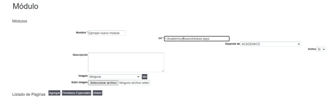
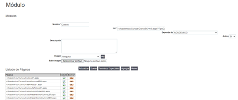
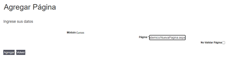
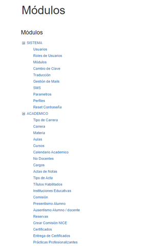

# Creación, edición y borrado de módulos

### Historia de revisiones del documento

09/05/2022 - Gabriel Benitez - Creación del documento

### Problemática

Describir los pasos para crear un módulo y dar acceso a una página.

### Contenidos

Para crear un módulo que permita acceder a una página del SGA, se deben seguir los siguientes pasos.

1.  Loguearse con un usuario con perfil administrador.

2.  Acceder por el menú SISTEMA/Módulos a la interfaz para crear o editar un módulo del sistema.

3. Para crear un nuevo acceso hacer clic en el botón “Agregar”\
   a) Completar los datos requeridos para dar de alta el nuevo módulo y presionar Agregar. Si la página aspx no existiera, es decir, no fue agregada y subida, va mostrar un mensaje “No se encontró la página”, aunque igualmente agrega el módulo. En este ejemplo se agrega un punto de acceso en el menú “Ejemplo nuevo módulo” dentro del menú “Académico” que accederá a la página NuevoModulo.aspx que se encuentra en la carpeta “Academica”.\
   \
   \
   \
   b) Una vez agregado el módulo, la botonera inferior muestra nuevas opciones, el botón “Agregar” nos va a permitir agregar páginas que sean accedidas desde este nuevo módulo y respetará los permisos que se le asignen al módulo, por ejemplo, desde el módulo Cursos se puede acceder a un montón de otras páginas, y éstas deben estar agregadas en el “Listado de Páginas”\
   \
   \
   \
   c) Cuando queremos agregar una página con acceso desde este módulo, presionamos “Agregar” y en la nueva interfaz colocamos el nombre de la aspx con la carpeta que la contiene y presionamos agregar, por ejemplo: “\~/Academico/NuevaPagina.aspx”. La opción “No Validar Página” permite agregar una página, aunque aún no esté subida, caso contrario no te permite agregar la página si no la encuentra en la ruta especificada.\
   \
   

Con estos pasos creamos un módulo nuevo dependiente de otro y agregamos su página principal y una segunda a la que se puede  acceder desde aquí.

Para editar o borrar un módulo ya existente se accede desde el punto de menú Sistema/Módulos y se hace clic en el que se quiere editar, buscándolo dentro del árbol de módulos mostrado.

