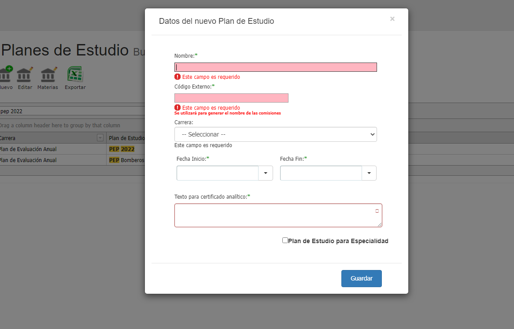
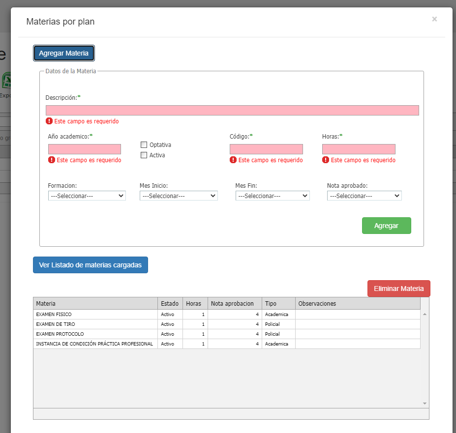

# Gestión de Planes de Estudio

### Historia de revisiones del documento

04/03/2022 - Gabriel Benitez - Creación del documento

### Problemática

Describir las tareas que se deben realizar para gestionar planes de estudio y sus materias.

### Contenidos

#### Crear Plan de Estudio

Desde la interfaz del SGA, a la que se accede desde la opción de menú Plan Académico / Planes de Estudio se puede crear, editar un plan. \
Para crear un plan se presiona el botón “Nuevo” y para editar los datos principales de un plan se lo selecciona de la grilla y se hace clic en el botón “Editar”.\
&#x20;Al crear o editar un plan se graban los siguientes campos en la tabla PlanEstudio:

| Campo          | Valor a grabar - Tipo de dato | Observación                                               |
| -------------- | ----------------------------- | --------------------------------------------------------- |
| PlanEstudioId  | Id del plan - int             | Es un autonumérico, automático, lo establece el motor SQL |
| CarreraId      | int                           | Se obtiene de la interfaz                                 |
| CodigoExterno  | varchar                       | Se obtiene de la interfaz                                 |
| FechaCreacion  | datetime                      | Se obtiene de la interfaz                                 |
| FechaFin       | datetime                      | Se obtiene de la interfaz                                 |
| TextoAnalitico | varchar                       | Se obtiene de la interfaz                                 |

#### Gestión de las materias de un plan de estudio

Desde la misma interfaz se administran las materias del plan de estudio. Se selecciona el plan de la grilla y se presiona el botón “Materias”. En la ventana emergente se agregan los campos de la materia a agregar o se elimina alguna ya creada. El alta de una materia en un plan de estudio es un proceso transaccionado que graba registros de dos tablas de la base. \
Los campos que se graban en la tabla Materia son:

| Campo        | Valor a grabar -Tipo de dato | Observación                                                               |
| ------------ | ---------------------------- | ------------------------------------------------------------------------- |
| MateriaId    | Id de la materia, int        | Es un autonumérico, automático, lo establece el motor SQL                 |
| Codigo       | varchar                      | Se obtiene de la interfaz                                                 |
| Descripcion  | varchar                      | Se obtiene de la interfaz                                                 |
| Activa       | varchar                      | Se obtiene de la interfaz, "S" si esta chequeado, "N" si no lo está       |
| Horas        | int                          | Se obtiene de la interfaz                                                 |
| Tipo         | varchar                      | Se obtiene de la interfaz, puede ser "ACA" (académico) o "POL" (policial) |
| NotaAprobado | int                          | Se obtiene de la interfaz, de 1 a 10                                      |

| Campo                | Valor a grabar - Tipo de dato | Observación                                                                             |
| -------------------- | ----------------------------- | --------------------------------------------------------------------------------------- |
| PlanEstudioMateriaId | Id de la materia, int         | Es un autonumérico, automático, lo establece el motor SQL.                              |
| PlanEstudioId        | int                           | Id del plan de estudio, se obtiene de la interfaz, es el plan seleccionado en la grilla |
| MateriaId            | int                           | Id de la materia (Materia.MateriaId)                                                    |
| AnioAcademico        | int                           | Se obtiene de la interfaz                                                               |
| MesInicio            | int                           | Se obtiene de la interfaz                                                               |
| MesFin               | int                           | Se obtiene de la interfaz                                                               |
| Optativa             | varchar                       | Se obtiene de la interfaz, "S" si ya está chequeado, "N" si no lo está                  |

