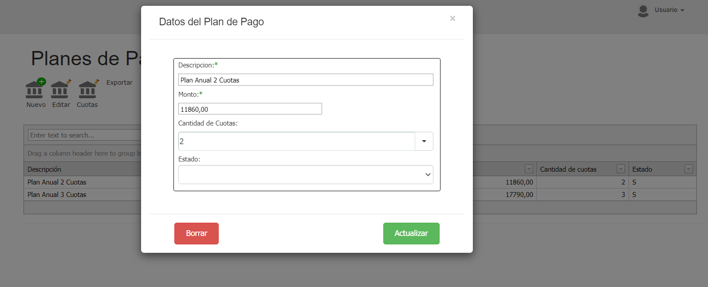
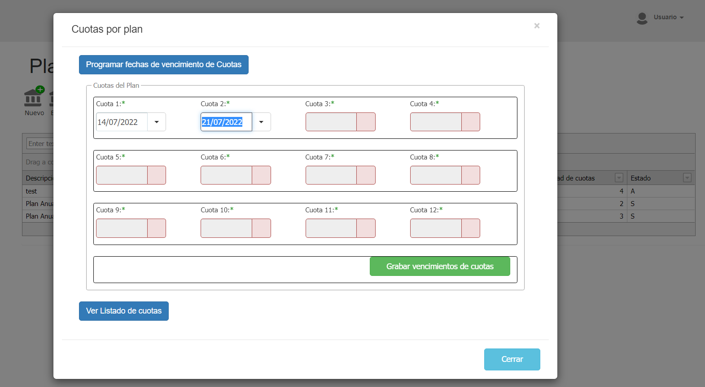
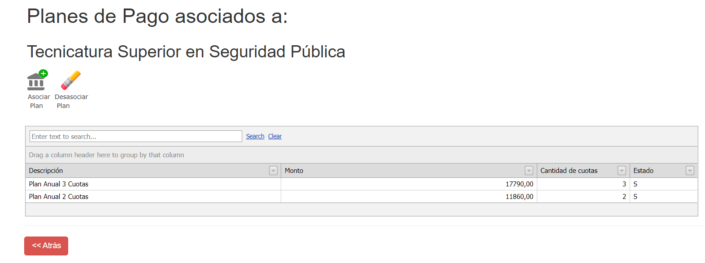

# Gestión de Planes de Pago de Carreras

### **Historia de revisiones del documento**

22/02/2022 - Gabriel Benitez: Creación del documento\
24/02/2022 - Gabriel Benitez: Modificación asociación de planes

### Problemática

Describir el procedimiento para gestionar los planes de pago para las carreras que corresponda y sus cuotas.

### Contenidos

#### Gestión del plan

Desde la interfaz del SGA, a la que se accede desde la opción de menú Plan Académico / Planes de Pago se puede crear, editar un plan. La edición permite dejar inactivo un plan, no eliminarlo. En esta interfaz también se pueden establecer las fechas de vencimiento de las cuotas, siempre que se graben fechas de cuotas, se sobrescriben las fechas existentes para ese plan, permitiendo cada año ir actualizando fechas sobre el mismo plan. \
Para crear un plan se presiona el botón “Nuevo” y para editar los datos principales de un plan se lo selecciona de la grilla y se hace clic en el botón “Editar”. \
Al crear o editar un plan se graban los siguientes campos en la tabla Plan:

| Campo                | Valor a grabar - Tipo de dato                                                    | Observación                                                |
| -------------------- | -------------------------------------------------------------------------------- | ---------------------------------------------------------- |
| PlanId               | Id del plan - int                                                                | Es un autonumérico, automático, lo establece el motor SQL. |
| Matricula            | varchar                                                                          | Se graba siempre "N"                                       |
| MatriculaMonto       | Numeric(18,2)                                                                    | Se graba siempre NULO (null)                               |
| Monto                | 
Es el valor TOTAL del plan Numeric(18,2)
                               | Se obtiene de la interfaz                                  |
| CantidadCuotas       | Cantidad de cuotas del plan - int                                                | Se obtiene de la interfaz                                  |
| MesInicioCuotas      | Mes de inicio de las cuotas - int                                                | En desuso                                                  |
| MesFinCuotas         | Mes de la última cuota del plan - int                                            | En desuso                                                  |
| Estado               | Estado del plan - varchar                                                        | Se graba "S". En desuso                                    |
| Descripcion          | Nombre del plan - varchar                                                        | Se obtiene de la interfaz.                                 |
| MesMatricula         | int                                                                              | En desuso                                                  |
| VencimientoMatricula | varchar                                                                          | En desuso                                                  |
| VencimientoCuota     | varchar                                                                          | En desuso                                                  |
| Tipo                 | Antiguamente se usaba como tipo de plan, ahora es el estado del mismo. - varchar | Se obtiene de la interfaz, combo estado.                   |

**Gestión de las cuotas**

Desde la misma interfaz se administran las fechas de vencimiento de las cuotas. Se selecciona el plan de pago de la grilla y se presiona el botón “Cuotas”. Si el plan está definido con N cuotas, en el sector que se muestra al presionar el botón “Programar fechas de vencimiento de Cuotas”, habilita N casilleros para ingresar las dichas fechas. El mínimo de cuotas posibles es 1 (una) y el máximo 12 (doce). Si el plan de pago ya tenía definido las cuotas se ven en la grilla inferior (se muestra u oculta con el botón “Ver listado de Cuotas”). Cada vez que se ingresan nuevas fechas de vencimiento y se presiona “Grabar Vencimiento de Cuotas”, se “pisan” las fechas existentes. Si el plan fue modificado y se definieron menos cuotas, por ejemplo, si se pasa un plan de 3 a 2 cuotas, al grabar nuevamente las fechas de vencimiento, se elimina la cuota 3.

Los campos que se graban en la tabla PlanCuota son:

| Campo            | Valor a grabar -  Tipo de dato              | Observación                                                            |
| ---------------- | ------------------------------------------- | ---------------------------------------------------------------------- |
| PlanCuotaId      | Id del plan - int                           | Es un autonumérico, automático, lo establece el motor SQL.             |
| PlanId           | Id del plan – int                           | Se obtiene de la interaz, del plan seleccioando en la grilla inferior. |
| FechaVencimiento | Fecha de vencimiento de la cuota - datetime | Se obtiene de la interfaz.                                             |

#### Relación del plan de pago con una carrera

Para que al generar el contrato de un alumno con la carrera se pueda seleccionar un plan de pagos, se debe relacionar la carrera y el plan. Esto se hace desde la interfaz que se encuentra en la opción de menú “Académico / Carrera”, seleccionando un registro de la grilla y presionando el botón “Pagos”. El SGA muestra una pantalla donde se ven los planes asociados a la carrera y permite asociar y “desasociar” uno o más planes de pago.

