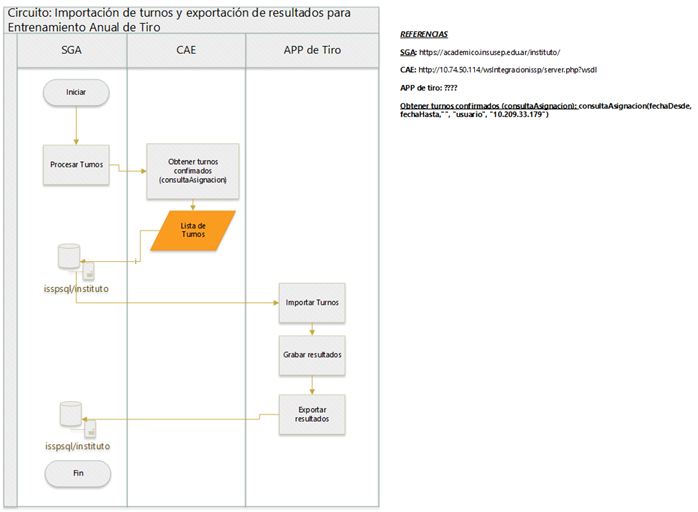

# Importación de Turnos de Entrenamiento Anual de Tiro

### Historia de Revisiones del Documento

15/11/2021 - Gabriel Benitez - Creación del documento

### Problemática

El Sistema de Gestión Académica (SGA) necesita los turnos generados y asignados en el sistema CAE (Sistemas de Policía de la Ciudad) para poder grabar resultados y asistencia y que esos datos estén disponibles en la aplicación de tiro que se utiliza para grabar dichos resultados y las fotos de los blancos, con el objetivo final de tener todo registrado en la base de datos del instituto.

### Relevamiento

### Contenidos

1. **SGA**\
   _Proyecto_: Techmind.Adiutor.GUI\
   _Página_: /PEA/ConsultaAsignacionWS.aspx
2. **CAE**\
   [http://10.74.50.114/wsIntegracionissp/server.php?wsdl](http://10.74.50.114/wsIntegracionissp/server.php?wsdl)
3. **App de Tiro**
