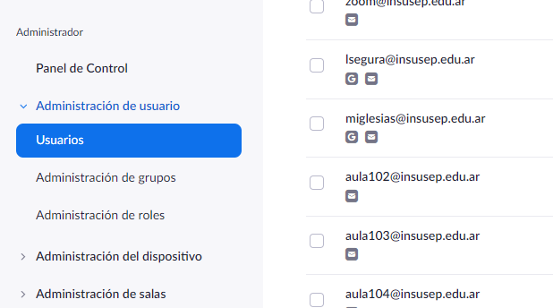
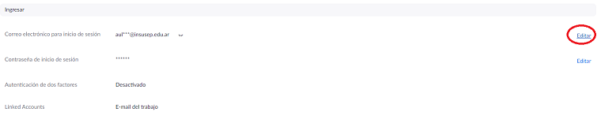
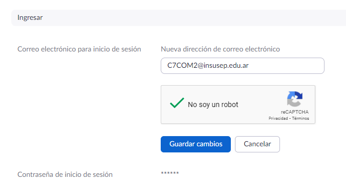
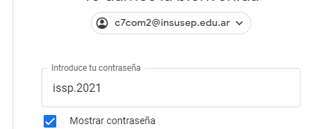
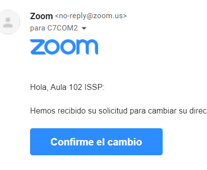
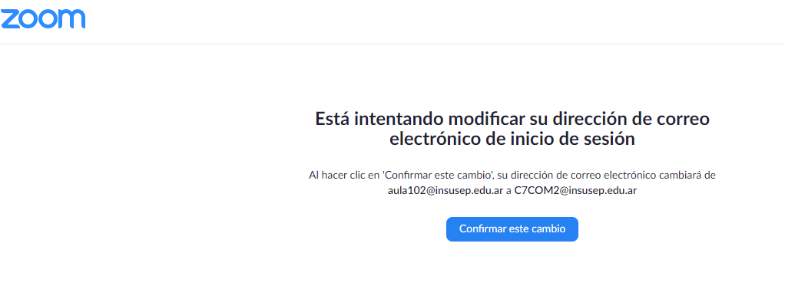
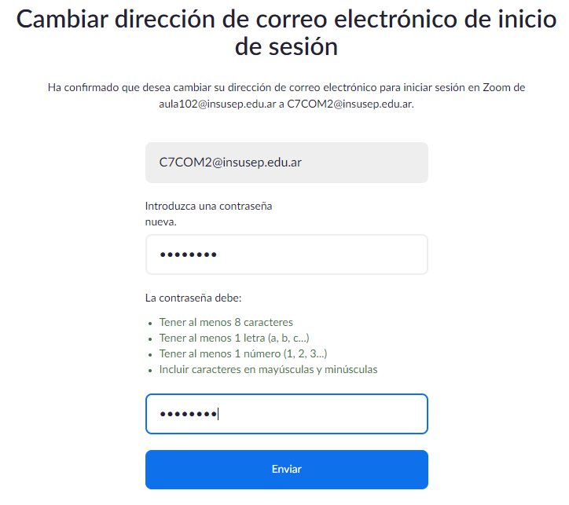
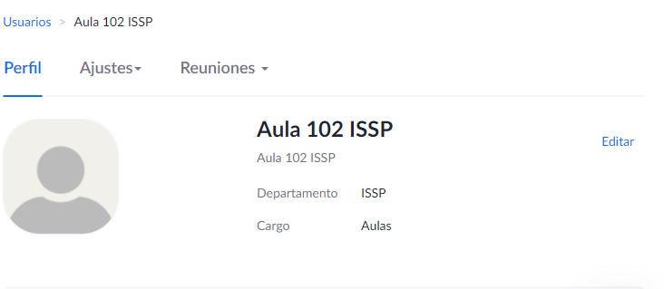
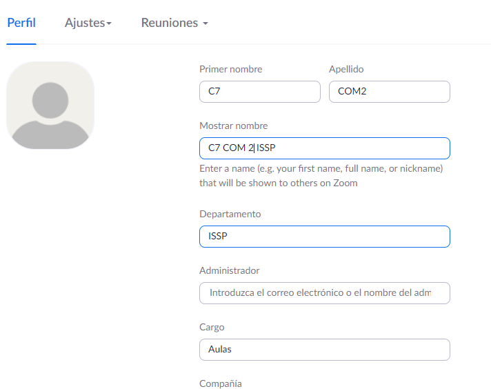

# Pasos para cambiar un mail en una cuenta de zoom

1\) Ingresar como administrador a [https://us02web.zoom.us/signin](https://us02web.zoom.us/signin)\
&#x20;   Usuario: zoom@insusep.edu.ar\
&#x20;   Contraseña: Insusep2020

2\) En el menú administrador acceder al submenú Usuarios

3\) Clic en el mail o nombre que se encuentra en la primer columna “Identificacion por e-Mail/nombre “

4\) En el apartado “Ingresar” , hacer clic en editar en donde se encuentra el correo electrónico

5\) Ingresar el nuevo mail y "Guardar cambios"

6\) Iniciar sesión en la casilla del mail ingresado en paso anterior

 

7\) Confirmar el cambio haciendo click en el botón del mail recibido desde Zoom

8\) Confirmar nuevamente el cambio en Zoom

9\) Ingresar contraseña para la cuenta de zoom (se está usando Aula1234)

10\) El mail ya fue modificado, ahora resta modificar el nombre del aula (que es el que se verá en el portal educativo) , repetir paso 3 pero esta vez editar en el 1er apartado, “Perfil”.

11\) Ingrese los nuevos datos y presione "Guardar cambios".

12\) Finalmente, desde el SIU, cambiar nombre y código en Espacios.
