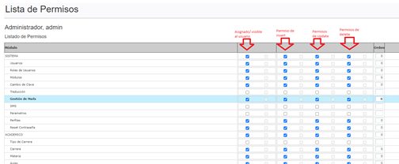
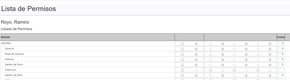
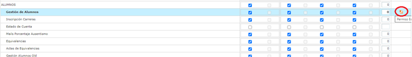
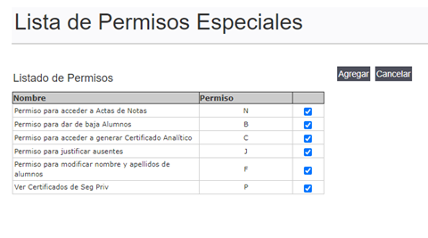

# Cómo dar permisos a usuarios o perfiles

### Historia de Revisiones del Documento

26/05/2022 - Gabriel Benitez - Creación del documento

### Problemática

Describir los pasos para dar permisos a usuarios a un módulo determinado.

### Contenidos

#### Asignación de Permisos

Para dar permisos a una página o módulo del SGA se deben seguir los siguientes pasos:\
1\. Loguearse con un usuario con perfil administrador.\
\
2\. Acceder por el menú SISTEMA/Perfiles o a SISTEMA/Usuarios dependiendo si queremos dar permisos a un grupo de usuarios con un perfil o a un usuario específico.\
\
3\. Seleccionamos el icono “PERM” de permisos que nos lleva a una nueva interfaz donde nos muestra todos los módulos y los permisos vigentes y que se pueden asignar al perfil o usuario, se seleccionan los permisos que se quieren asignar y se presiona “Actualizar” en la parte inferior de la pantalla. A tener en cuenta, el primer check indica si el usuario va a poder ver acceso desde el menú, luego si tiene permisos de insert, update y delete sobre los registros de la tabla, si la interfaz en cuestión tiene esas funcionalidades, por ejemplo, para la interfaz de alta de un curso, si solo tiene asignado el primero, podrá ver los cursos pero no agregar, editar o eliminar uno.&#x20;

En la interfaz se ven dos grupos de checks, los primeros de cada grupo son permisos propios del perfil o usuario, los segundos son permisos heredados de un perfil o usuario. Cuando son permisos heredados no se pueden editar, en caso de querer hacerlo se crean permisos propios para el usuario. En la siguiente imagen vemos los permisos de un usuario heredado del perfil “admin”. El usuario que se muestra a continuación no tiene permisos propios, sino heredados del perfil “admin”.

#### Permisos especiales

El SGA permite agregar permisos especiales para acciones particulares, por ejemplo, modificar nombre y apellido de un alumno en la ficha de alumno, esto no es una acción permitida a cualquier usuario por lo que se implementó un permiso especial para ello. Se buscan los permisos del módulo y si tiene un icono naranja en la última columna, ese módulo tiene permisos especiales para asignar.

Se hace clic en ese icono que nos lleva a otra interfaz, donde se selecciona el check del permiso y “Agregar” para grabar.

