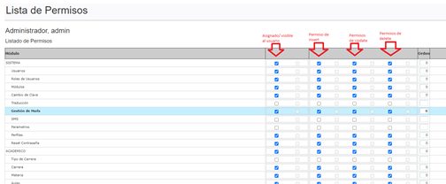
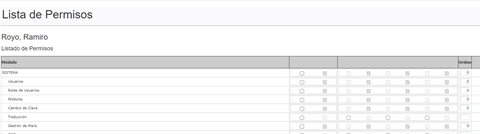
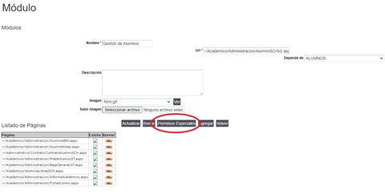
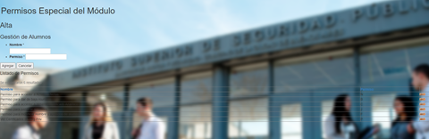

# Permisos de acceso a usuarios o perfiles

### Historia de Revisiones del Documento

09/05/2022 - Gabriel Benitez - Creación del documento\
10/05/2022 - Gabriel Benitez - Actualización del documento

### Problemática

Describir los pasos para dar permisos a usuarios a un módulo determinado.

### Contenidos

#### Asignación de permisos

Para dar permisos a una página o módulo del SGA se deben seguir los siguientes pasos:\
1\. Loguearse con un usuario con perfil administrador.\
\
2\. Acceder por el menú SISTEMA/Perfiles o a SISTEMA/Usuarios dependiendo si queremos dar permisos a un grupo de usuarios con un perfil o a un usuario específico.\
\
3\. Seleccionamos el icono “PERM” de permisos que nos lleva a una nueva interfaz donde nos muestra todos los módulos y los permisos vigentes y que se pueden asignar al perfil o usuario, se seleccionan los permisos que se quieren asignar y se presiona “Actualizar” en la parte inferior de la pantalla. A tener en cuenta, el primer check indica si el usuario va a poder ver acceso desde el menú, luego si tiene permisos de insert, update y delete sobre los registros de la tabla, si la interfaz en cuestión tiene esas funcionalidades, por ejemplo para la interfaz de alta de un curso, si solo tiene asignado el primero, podrá ver los cursos pero no agregar, editar o eliminar uno.

4\. En la interfaz se ven dos grupos de checks, los primeros de cada grupo son permisos propios del perfil o usuario, los segundos son permisos heredados de un perfil o usuario. Cuando son permisos heredados no se pueden editar, en caso de querer hacerlo se crean permisos propios para el usuario. En la siguiente imagen vemos los permisos de un usuario heredado del perfil “admin”. El usuario que se muestra a continuación no tiene permisos propios, sino heredados del perfil “admin”.

#### Permisos Especiales

El SGA permite agregar permisos especiales para acciones particulares, por ejemplo, modificar nombre y apellido de un alumno en la ficha de alumno, esto no es una acción permitida a cualquier usuario por lo que se implementó un permiso especial para ello. Los permisos especiales se almacenan en la tabla TMUsersSpecialAccess, a continuación, se muestra la estructura de la tabla:

| Campo               | Tipo de dato      | Descripción                                                                   |
| ------------------- | ----------------- | ----------------------------------------------------------------------------- |
| UsersSpecialAccesID | int, autonumérico | Clave primaria de la tabla                                                    |
| USAName             | varchar(255)      | Descripción de la acción que permite                                          |
| USAPermission       | varchar(1)        | Letra que se utiliza como permiso y en el código para gestionarlo             |
| SystemModulesID     | int               | Id del módulo dentro del cual se encuentra la acción que se quiere gestionar. |

_**IMPORTANTE**: Letras reservadas que no se pueden usar I (Insert), U (Update), D (Delete) y todas aquellas ya usadas y que están en la tabla descripta anteriormente._

Para agregar un permiso especial se debe ir a SISTEMA/Módulos, editar un módulo y luego hacer clic en el botón “Permisos Especiales”_:_

Cabe destacar que toda esta funcionalidad está dentro de un componente antiguo y “externo” y cuya funcionalidad hay que migrar, por lo tanto, la interfaz para agregar, eliminar o editar un permiso especial se ve de la siguiente forma:

Para que un permiso especial funcione se debe “programar”. Siguiendo con el ejemplo de la modificación de nombre y apellido de un alumno, copiamos un pedazo de código para mostrar cómo se implementa:

`_txtNombre.Enabled = this.Permissions.Contains("F");`

`_txtApellido.Enabled = this.Permissions.Contains("F");`

El “Permiso para modificar nombres y apellidos de alumnos” tiene la letra “F”, en el código se ve que se toman los controles de texto para nombre y apellido y se los “deshabilita o habilita” teniendo en cuenta si el usuario logueado tiene el permiso o no. Se puede deshabilitar o se puede poner visible o no un control (botón o casilla de texto), de acuerdo al comportamiento deseado.

¿Qué es “this.Permissions”?\
``Es un atributo público implementado en la página Base (Techmind.TMMenu.GUI.Base), y que trae las “letras” o permisos relacionados a ésta, aplicando el Contains se está verificando si el permiso “F” se encuentra dentro de la lista de permisos del módulo para el usuario logueado.
