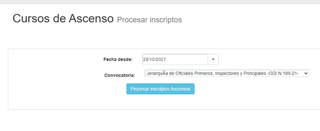

# Procesamiento de inscriptos CAE y asignación de turnos de examen para ascenso

### Historia de Revisiones del Documento

20/11/2021 - Gabriel Benitez - Creación del documento

### Problemática

El Sistema de Gestión Académica (SGA) debe obtener del sistema CAE de Policía de la Ciudad los inscriptos a las distintas convocatorias, inscribirlas en el plan de estudio, curso y comisión que corresponda, además asignar turno para examen y crear el usuario en la plataforma virtual Moodle, sino existiera, para luego matricularlo en el curso virtual.

### Relevamiento

Contenidos

1.  **SGA**\
    **Proyecto**: Techmind.Adiutor.GUI\
    **Página**: /PEA/PEP\_ProcesarInscriptos.aspx\
    **Punto de acceso**:\
    \
    \
    \
    _Interfaz al acceder a "Procesar Inscriptos"_\
    __\
    __\
    \
    __Cuando el usuario elige una fecha, el SGA consulta a los servicios webs del CAE, que según la definición de sistemas de policía de la ciudad se debe llamar de la siguiente forma:

    _**`“para poder obtener las convocatorias que poseen una fecha en la especificada se debería llamar al método de la siguiente manera:`**_

    _**`ws.consultaConvocatoriasV2("", "20210830","" , "usuario", "10.209.33.179");`**_

    _**`En este caso el formato de fecha es aaaammdd.`**_

    _**`En el caso de las convocatorias de curso de ascenso, esa llamada, efectivamente te va a devolver las convocatorias que inician en la fecha especificada. No así con las convocatorias del tipo PEP, que te va a devolver todas las que tengan una fecha en la especificada, que no necesariamente es la de inicio de la misma.”`**_

    Una vez seleccionada la convocatoria, se inicia el proceso haciendo clic en “Procesar Inscriptos Ascenso”\
    \
    \
    \
    **Inscribe en Plan de Estudio, Actualiza datos en el Legajo de Tiro, Crea legajo de Tiro  y Agrega turno presencial en la fecha**

    Las funciones mencionadas utilizan el procedimiento almacenado “PAE\_ImportarAscensoWS” que recibe los siguientes parámetros:\
    \

    | **Nombre del parámetro**      | **Tipo de dato** | **Objeto: wsIntegracionPM.Asignacion (CAE)**                             | **Descripción**                 |
    | ----------------------------- | ---------------- | ------------------------------------------------------------------------ | ------------------------------- |
    | @Fecha                        | Datetime         | Item.Fecha\_Examen                                                       | Fecha del turno                 |
    | @HoraTurno                    | Varchar(5)       | Item.Turno\_Examen                                                       | Hora del turno en formato HH:mm |
    | @AS\_ID                       | Int              | Item.AS\_ID                                                              | Se recibe del CAE               |
    | @PlanEstudioId                | Int              | nulo                                                                     | En desuso                       |
    | @LogImportacionTurnoProcesoId | Int              | Id interno del SGA: LogWSImportacionCabecera. LogWSImportacionCabeceraId | Id del proceso                  |
    | @Convocatoria\_Id             | Int              | Item.Convocatoria\_Id                                                    | Se recibe del CAE               |
    | @DNI                          | Int              | Item.Personal\_DNI                                                       | Nro de documento del personal   |

    \
    **Inscribe en Plan de Estudio, Actualiza datos en el Legajo de Tiro, Crea legajo de Tiro  y Agrega turno presencial en la fecha**

    Las funciones mencionadas utilizan el procedimiento almacenado “PAE\_ImportarAscensoWS” que recibe los siguientes parámetros:\
    \
    **Inscribir en Cursos Moodle relacionados**

    Utiliza el método “Techmind.Adiutor.Moodle.InscribirAlumnoEnCurso”:\

    _**`InscribirAlumnoEnCurso(long _DNI, string apellido, string nombre, string email, string Moodle_idCurso, bool _enviarMail, string inicio =””, string fin=””, string opcionMoodle = “ISSP”, bool passwordDefault = true, string role = “5” )`**_\
    _****_

    &#x20;    1\)      \_DNI: número de documento del inscripto.

    &#x20;    2\)      apellido: apellido del inscripto.

    &#x20;    3\)      nombre: nombre del inscripto.

    &#x20;    4\)      Email: email del inscripto.

    &#x20;    5\)      Moodle\_idCurso: id del curso Moodle donde va a ser inscripto.

    &#x20;    6\)      \_enviarMail: verdadero si desea enviar el mail al alumno al inscribirse.

    &#x20;    7\)      \_inicio: fecha y hora de inicio de la matriculación.

    &#x20;    8\)      \_fin: fecha y hora de fin, para desactivar la matriculación del alumno, a partir de esta\
    &#x20;             fecha y hora el alumno no puede acceder más al curso.

    &#x20;    9\)      opcionMoodle: “ISSP” o “IUSE” dependiendo de la plataforma a utilizar.

    &#x20;    10\)   passwordDefault: verdadero por defecto, para que genere el password en Moodle \
    &#x20;            tomando la clave del archivo de configuración, falso para que genere automáticamente.

    &#x20;    11\)   Role: 5 por defecto, es el rol de alumno en Moodle.\

2. **CAE**\
   [http://10.74.50.114/wsIntegracionissp/server.php?wsdl](http://10.74.50.114/wsIntegracionissp/server.php?wsdl)
3.  **Servicios Web Moodle ISSP**\
    [https://webcampus.insusep.edu.ar/webservice/rest/server.php?wstoken=e9360ce79d93f3cee654028dbb012d62](https://webcampus.insusep.edu.ar/webservice/rest/server.php?wstoken=e9360ce79d93f3cee654028dbb012d62)

    Documentación: [https://webcampus.insusep.edu.ar/admin/webservice/documentation.php](https://webcampus.insusep.edu.ar/admin/webservice/documentation.php)
4.  #### Servicios Web Moodle IUSE

    [https://iusecampus.insusep.edu.ar/webservice/rest/server.php?wstoken=14966b3a88f9327c7e7243411b09da1f](https://iusecampus.insusep.edu.ar/webservice/rest/server.php?wstoken=14966b3a88f9327c7e7243411b09da1f)

    Documentación: [https://iusecampus.insusep.edu.ar/admin/webservice/documentation.php](https://iusecampus.insusep.edu.ar/admin/webservice/documentation.php)

### Pre-requisitos

Para que el circuito funcione se necesitan que en el SGA se hayan creado:

1. Plan de estudio (con la o las materias).\

2. Comisiones de ese plan de estudio.\

3. Cursos relacionados a esas comisiones.\

4. Relacionar las comisiones con la convocatoria CAE y la plataforma virtual (ISSP o IUSE).\

5. Relacionar los cursos con la plataforma virtual (ISSP o IUSE), el id de curso virtual y el id de examen virtual.
