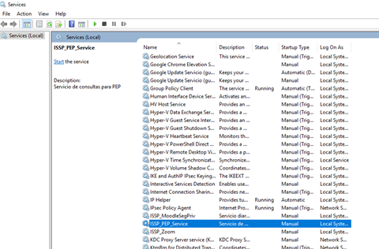

# Servicio Automático PEP

### Historia de Revisiones del Documento

08/03/2022 - Gabriel Benitez - Creación del documento

### Problemática

Describir el servicio automático utilizado para habilitar los cursos virtuales de los inscriptos para el Plan de Evaluación Permanente (PEP).

### Contenidos

El servicio automático “ISSP\_PEP”, para habilitar los cursos en la plataforma virtual a los inscriptos al PEP de acuerdo al turno presencial realiza los siguientes pasos:

* Obtiene los turnos que están agendados para dentro de N días.\
  &#x20;  • Ese N está establecido en el archivo de configuración del sistema (App.config) y se\
  &#x20;     denomina “CantDiasPrevios”.\
  &#x20;  • Utiliza el procedimiento almacenado “PEP\_GetTurnosADias”.
* Recorre uno a uno esos turnos y obtiene la jerarquía del personal inscripto.\
  &#x20;  • Realiza una consulta en la tabla “JerarquiaPCBA”.
* Obtiene el id del curso de Moodle donde lo tiene que inscribir.\
  &#x20;  • Realiza una consulta en la tabla “JerarquiaPCBAExamenMoodle” con la jerarquía que obtuvo \
  &#x20;    en el paso anterior para obtener el valor del campo “MoodleCourseId”, que es el curso al que \
  &#x20;    lo debe inscribir y “OpcionMoodle” que determina en cuál de las plataformas Moodle debe \
  &#x20;    realizarse la inscripción ISSP o IUSE.\
  &#x20;  • Inscribe en el curso de Moodle correspondiente usando la opción “passwordDefault” en  \
  &#x20;     verdadero para que cree o actualice el usuario con la clave establecida como convención \
  &#x20;     que está en el archivo de configuración DNI + “MoodleISSP\_ClaveDefaultSufijo” o DNI + \
  &#x20;    “MoodleIUSe\_ClaveDefaultSufijo” según corresponda.
* Si el turno corresponde a personal de bomberos, busca si debe inscribirlo a un curso extra en Moodle.\
  &#x20;  • Realiza una consulta en la tabla “JerarquiaPCBAExamenMoodle” con la jerarquía utilizada en \
  &#x20;     el paso anterior para obtener el valor del campo “MoodleExtraCourseId” , que es el curso al \
  &#x20;     que lo debe inscribir y “OpcionMoodle” que determina en cuál de las plataformas Moodle \
  &#x20;     debe realizarse la inscripción ISSP o IUSE.\
  &#x20;  • Inscribe en el curso de Moodle correspondiente usando la opción “passwordDefault” en \
  &#x20;     verdadero para que cree o actualice el usuario con la clave establecida como convención \
  &#x20;     que está en el archivo de configuración DNI + “MoodleISSP\_ClaveDefaultSufijo” o DNI + \
  &#x20;     “MoodleIUSe\_ClaveDefaultSufijo” según corresponda.
* Graba un log con los datos de la inscripción.\
  &#x20;  • Graba en la tabla “PEP\_LogInscripcionMoodle” los siguientes campos:\
  &#x20;         • FechaHoraInscripcion: fecha y hora actual.\
  &#x20;         • Apellido: apellido de la persona inscripta al turno.\
  &#x20;         • Nombre: nombre de la persona inscripta al turno.\
  &#x20;         • DNI: número de documento de la persona inscripta al turno.\
  &#x20;         • Email: correo electrónico de la persona inscripta al turno.\
  &#x20;         • ResultadosOK: “S” si inscribió sin errores, “N” caso contrario.
* Si se produjo un error deja también una entrada en el registro que se puede ver desde los logs de eventos del servidor.

### Datos sobre el servicio

El servicio está instalado y corriendo el servidor 10.26.250.233 y se lo puede identificar en la lista de servicios con el nombre “ISSP\_PEP\_Service”, se instala como inicio automático con delay, se adjunta imagen:

### Correo para control

Cada jornada se enviará un correo electrónico para control del log de inscripciones a [desarrollo@insusep.edu.ar](mailto:desarrollo@insusep.edu.ar) y a la casilla que determine el área académica. El “job” de SQL Server que se encarga de este envío se llama “Log Inscripcion en Moodle (PEP)” y se ejecuta diariamente a las 11.00 horas desde el 30/03/2022. Está configurado en el servidor de SQL ISSPSQL (IP:10.26.250.18)
